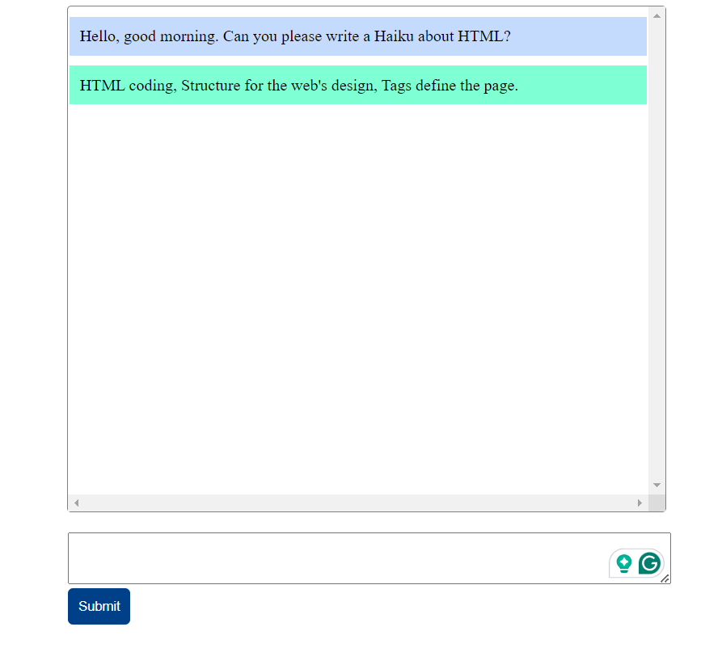

# Minimal Chat Application

This is the front end of a simple Chat App created on top of OPENAI API.

## How to get started

To contribute or have a local working version of this project, first setup your backend using [this repo](https://github.com/joelnyongesa/minimal-chat-app), then follow the steps below:

1. Fork and clone the project
2. Navigate to the project's directory using your terminal
3. Run the server using LiveServer extension, or open the `index.html` file in your browser.

## Demo

## Contributors

1. Joel Nyongesa